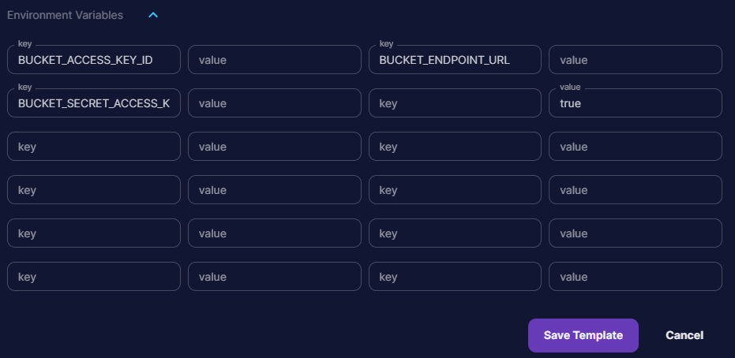

## S3 Uploader

.env variables:

```bash
# S3 Bucket
BUCKET_ENDPOINT_URL= # S3 bucket endpoint url
BUCKET_ACCESS_KEY_ID= # S3 bucket access key id
BUCKET_SECRET_ACCESS_KEY= # S3 bucket secret access key
```

*Note: The upload utilitiy utilizes the Virtual-hosted-style URL with the bucket name in the host name. For example, `https://bucket-name.s3.amazonaws.com`.*



## Validator Utility (rp_validator.py)

The validator utility allows you to define the expected inputs for your worker and validate them against the input data. It will return the errors if any are found and prevent the worker from running.

The `validate` function takes in two arguments, the first is the input data and the second is the schema to validate against. If you have a nested input you will need to define septate schemas for each layers and call the validator on them individually.

The schema is a nested dictionary that defines the validation rules for each input. For each input you can define the following rules:

- `required` (defaults `False`) - If the input is required or not (true/false)
- `default` (defaults `None`) - A default value to use if the input is not provided.
- `type` (required) - The type of the input
- `constraints` (optional) - A lambda function that takes in the input and returns true or false

## Cleanup Utility (rp_cleanup.py)

The cleanup utility provides a `clean` function to remove specified folders and files after a job is completed. By default, it removes the `input_objects`, `output_objects`, and `job_files` folders, as well as the `output.zip` file. You can also provide an optional list of folders to be removed.

## Download Utility (rp_download.py)

The download utility provides functions to download files or objects from given URLs. The `download_input_objects` function takes a list of object locations (URLs) and downloads them into a temporary directory called `input_objects`. The `file` function downloads a single file from a given URL and saves it with a random name. If the downloaded file is a zip file, it is extracted into a directory with the same name.
